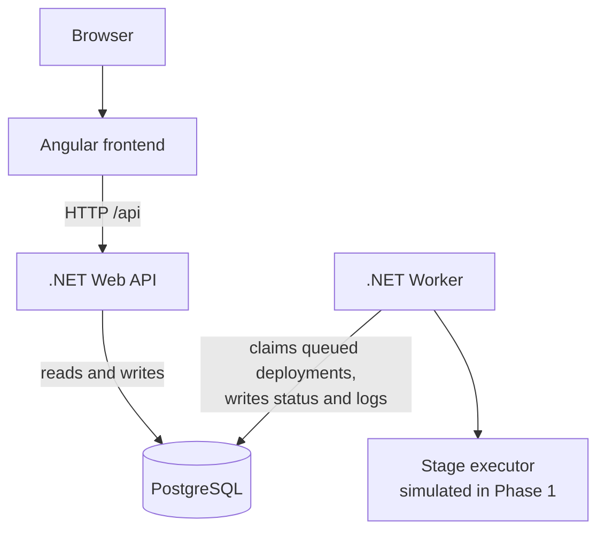
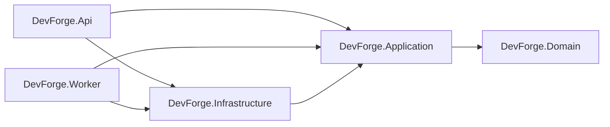
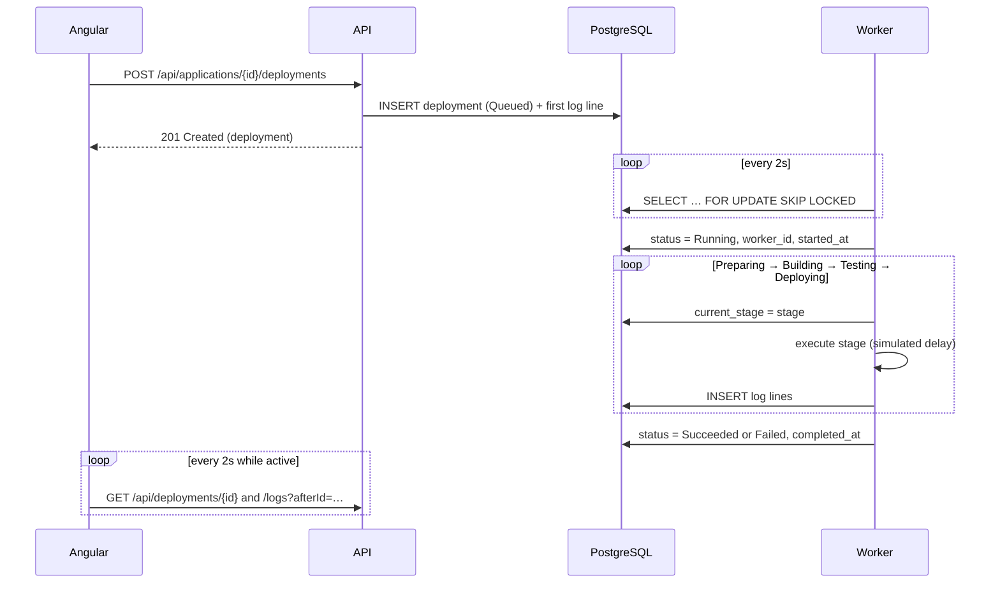

# DevForge

DevForge is a small, self-hosted developer platform — a simplified Heroku/Render — built as a long-term DevOps learning project.

**This repository is at Phase 1: a solid local foundation.** You can register applications, trigger deployments, and watch a worker carry each one through a pipeline with live status and logs. The pipeline itself is *simulated*: nothing is cloned, built or deployed yet. Everything around it — the queue, the state machine, persistence, the API and the UI — is real.

New to the project? Read **[How DevForge works](docs/HOW-IT-WORKS.md)** first: a plain-language tour of every part, with things to try once it is running.

For the Phase 2 feature, read **[Real deployments (Docker mode)](docs/REAL-DEPLOYMENTS.md)**: where a repository is downloaded, how it is built, and how the application is started.

## Contents

1. [Architecture](#architecture)
2. [Technology stack](#technology-stack)
3. [Repository structure](#repository-structure)
4. [Run locally](#run-locally)
5. [Run with Docker Compose](#run-with-docker-compose)
6. [Database migrations](#database-migrations)
7. [How a deployment works](#how-a-deployment-works)
8. [API overview](#api-overview)
9. [Configuration](#configuration)
10. [Tests](#tests)
11. [Current limitations](#current-limitations)
12. [Future phases](#future-phases)

## Architecture



The API and the Worker never talk to each other. They share the database, and the `deployments` table is the queue: the API inserts a row with status `Queued`, and a worker claims it.

### Layers



| Project | Responsibility |
|---|---|
| `DevForge.Domain` | Entities, enums, the `RepositoryUrl` value object and the deployment state machine. No dependencies. |
| `DevForge.Application` | Use cases (application, deployment and dashboard services), DTOs, and the pipeline orchestrator. Defines the interfaces it needs: `IAppDbContext`, `IDeploymentQueue`, `IStageExecutor`. |
| `DevForge.Infrastructure` | EF Core `AppDbContext`, Fluent API configurations, migrations, the PostgreSQL queue, and the simulated stage executor. |
| `DevForge.Api` | Controllers, ProblemDetails error handling, health checks. |
| `DevForge.Worker` | A `BackgroundService` that polls the queue and runs the pipeline. References Application and Infrastructure only — never the API. |

### Design decisions worth knowing

- **The entity is called `App`, not `Application`.** A class named `Application` collides with the `DevForge.Application` namespace. The table, API routes and DTOs still say "application".
- **The database is the queue.** A worker claims work with `SELECT … FOR UPDATE SKIP LOCKED` inside a transaction, so any number of worker instances can run without two of them taking the same deployment. The seam is `IDeploymentQueue`; a broker can replace it later.
- **Status and stage are separate.** `DeploymentStatus` is the lifecycle (`Queued`, `Running`, `Succeeded`, `Failed`, `Cancelled`). `DeploymentStage` is the position in the pipeline (`Preparing`, `Building`, `Testing`, `Deploying`). Both are enums stored as text and guarded by `CHECK` constraints.
- **The pipeline owns state; the executor owns work.** `DeploymentRunner` moves a deployment through its stages and persists every transition. `IStageExecutor` does the actual work of one stage. Swapping the simulated executor for Docker, Kubernetes Jobs or a CI runner means writing one class.
- **One active deployment per application.** Checked in the service and enforced by a partial unique index, so concurrent Deploy clicks produce one deployment and `409 Conflict` for the rest.
- **Application status is derived, not stored.** It comes from the most recent deployment: `NeverDeployed`, `Deploying`, `Running` or `Failed`.
- **A `Build` is its own entity.** A deployment points to the build it produced, which lets a later phase redeploy an existing build (rollback) without rebuilding.
- **No MediatR and no per-entity repositories.** Application services use EF Core through `IAppDbContext`; the extra layers would add indirection without adding behaviour at this size.
- **The frontend calls a relative `/api`.** The Angular dev server and the production nginx both proxy it to the API, so there is no CORS setup and one build works everywhere.

## Technology stack

| Area | Technology |
|---|---|
| Frontend | Angular 21 (standalone components, signals, zoneless), TypeScript, SCSS, Reactive Forms, Vitest |
| Backend | .NET 10, ASP.NET Core Web API, EF Core 10 |
| Worker | .NET 10 Worker Service (`BackgroundService`) |
| Database | PostgreSQL 17, Npgsql, EF Core migrations, snake_case naming |
| Tests | xUnit, `WebApplicationFactory`, real PostgreSQL |
| Local platform | Docker Compose, nginx |

No UI component library is used; the styling is a small set of design tokens in `src/styles.scss`.

## Repository structure

```text
devforge/
├── backend/
│   ├── DevForge.Api/              Controllers, error handling, health checks
│   ├── DevForge.Application/      Services, DTOs, pipeline, abstractions
│   ├── DevForge.Domain/           Entities, enums, value objects
│   └── DevForge.Infrastructure/   DbContext, configurations, migrations, queue, executor
├── worker/
│   └── DevForge.Worker/           BackgroundService host
├── frontend/
│   └── devforge-web/              Angular app (core / shared / features)
├── tests/
│   ├── DevForge.UnitTests/        Domain and application logic
│   └── DevForge.IntegrationTests/ API and worker against PostgreSQL
├── docker/                        Dockerfiles and nginx config
├── docs/                          Plain-language guides (HOW-IT-WORKS.md, REAL-DEPLOYMENTS.md)
├── docker-compose.yml
├── .env.example
├── Directory.Build.props          Shared build settings (nullable, warnings as errors)
├── Directory.Packages.props       Central NuGet package versions
└── DevForge.slnx
```

## Run locally

**Prerequisites:** .NET SDK 10, Node.js 22.12 or newer, and a PostgreSQL server (the Compose file provides one).

1. Create your local environment file and start PostgreSQL:

   ```bash
   cp .env.example .env
   docker compose up -d postgres
   ```

   This publishes PostgreSQL on host port **5440** (not 5432, to stay clear of any PostgreSQL already installed on the machine). The development connection string in `appsettings.Development.json` matches the defaults in `.env.example`. To use a different server, set the `ConnectionStrings__DevForge` environment variable for both the API and the Worker.

2. Start the API (applies migrations on startup in Development):

   ```bash
   dotnet run --project backend/DevForge.Api
   ```

   It listens on <http://localhost:5080>. The OpenAPI document is at `/openapi/v1.json`.

3. Start the worker in a second terminal:

   ```bash
   dotnet run --project worker/DevForge.Worker
   ```

4. Start the frontend in a third terminal:

   ```bash
   cd frontend/devforge-web
   npm install
   npm start
   ```

   Open <http://localhost:4200>. The dev server proxies `/api` to the API (`proxy.conf.json`).

## Run with Docker Compose

```bash
cp .env.example .env      # once
docker compose up --build
```

| Service | URL |
|---|---|
| Frontend | <http://localhost:8080> |
| API | <http://localhost:5080> (health: `/health`, `/health/ready`) |
| PostgreSQL | `localhost:5440` |

Compose starts `postgres`, then `api` (which migrates the database), then `worker` and `frontend` once the API reports healthy. PostgreSQL data lives in the `postgres-data` volume and survives restarts; `docker compose down -v` deletes it.

Credentials and ports come from `.env`, which is git-ignored. The Compose file itself contains no secrets and refuses to start without the PostgreSQL variables.

To process deployments in parallel, run more workers:

```bash
docker compose up -d --scale worker=3
```

## Database migrations

Migrations live in `backend/DevForge.Infrastructure/Persistence/Migrations`. `EnsureCreated()` is never used.

Install the EF Core tool once: `dotnet tool install --global dotnet-ef`.

```bash
# Add a migration after changing entities or configurations
dotnet ef migrations add <Name> \
  --project backend/DevForge.Infrastructure \
  --startup-project backend/DevForge.Api \
  --output-dir Persistence/Migrations

# Apply migrations by hand
dotnet ef database update \
  --project backend/DevForge.Infrastructure \
  --startup-project backend/DevForge.Api
```

Run these with `ASPNETCORE_ENVIRONMENT=Development` so the tool finds the development connection string.

The API also applies pending migrations at startup when `Database:MigrateOnStartup` is `true`. That is on in Development and in Compose, and off by default.

### Schema

| Table | Purpose | Notable constraints and indexes |
|---|---|---|
| `applications` | Registered applications | Unique `name`; index on `created_at` |
| `deployments` | One row per deployment; doubles as the queue | Unique `(application_id, number)`; partial unique index allowing one `Queued`/`Running` row per application; `(status, created_at)` for the queue scan; `CHECK` on `status` and `current_stage` |
| `builds` | The build a deployment produced | `(application_id, started_at)`; `CHECK` on `status` |
| `deployment_logs` | Append-only log lines | `(deployment_id, id)`; identity `id` doubles as a cursor |

Deleting an application cascades to its deployments, builds and logs. The API refuses the delete with `409` while a deployment is still queued or running.

## How a deployment works



1. **Deploy** creates a `Queued` deployment and returns immediately. The API does no pipeline work.
2. The **worker** polls every `Worker:PollingInterval`. It claims the oldest queued deployment and marks it `Running` in one transaction.
3. The **runner** enters each stage in order, saving the stage before running it. The Building stage also creates a `Build` record.
4. The **simulated executor** waits `Simulation:StageDelay` per stage and writes the log lines a real pipeline would. Each line is saved as it is written.
5. The deployment ends `Succeeded`, or `Failed` with an `error_message` and the stage that failed.
6. The **UI** polls the deployment and fetches only new log lines until the status is final, then stops.

**Simulating a failure.** Tick *Simulate failure* next to the Deploy button. The worker fails that deployment at `Simulation:FailureStage` (default `Testing`). The option appears only when `Features:FailureSimulation` is enabled; the API rejects the flag otherwise.

**If the worker shuts down mid-deployment,** it marks the deployment `Failed` with a message saying so before it exits.

## API overview

All responses are JSON. Enums are strings.

| Method | Path | Description | Success |
|---|---|---|---|
| GET | `/api/applications` | List applications with status and last deployment | 200 |
| POST | `/api/applications` | Create an application | 201 + `Location` |
| GET | `/api/applications/{id}` | Get one application | 200 |
| PUT | `/api/applications/{id}` | Update name, repository URL, branch, description | 200 |
| DELETE | `/api/applications/{id}` | Delete an application and its history | 204 |
| GET | `/api/applications/{id}/deployments` | Deployment history, newest first | 200 |
| POST | `/api/applications/{id}/deployments` | Queue a deployment. Optional body: `{ "simulateFailure": true }` | 201 + `Location` |
| GET | `/api/deployments/{id}` | Deployment status, timings and pipeline steps | 200 |
| GET | `/api/deployments/{id}/logs?afterId=` | Log lines, optionally only those after a log id | 200 |
| GET | `/api/dashboard/summary?todayStart=` | Counts plus recent applications and deployments | 200 |
| GET | `/api/platform` | Supported runtimes and enabled features | 200 |
| GET | `/health` | Liveness: the process is serving requests | 200 |
| GET | `/health/ready` | Readiness: the API can reach PostgreSQL | 200 / 503 |

### Errors

Every error is an RFC 9457 problem details document. Stack traces are never returned.

```json
{
  "type": "https://tools.ietf.org/html/rfc9110#section-15.5.5",
  "title": "Resource not found",
  "status": 404,
  "detail": "Application '0199…' was not found.",
  "traceId": "00-…"
}
```

| Status | When |
|---|---|
| 400 | Validation failed. An `errors` object maps each field to its messages. |
| 404 | The application or deployment does not exist. |
| 409 | Duplicate application name, a deployment already in progress, or deleting an application that is deploying. |
| 500 | Unexpected failure. The detail is generic; the cause is in the API log. |

## Configuration

Settings are read from `appsettings.json`, then `appsettings.{Environment}.json`, then environment variables (use `__` for nesting, for example `Worker__PollingInterval`).

| Setting | Used by | Default | Meaning |
|---|---|---|---|
| `ConnectionStrings:DevForge` | API, Worker | *(none; set for Development)* | PostgreSQL connection string |
| `Database:MigrateOnStartup` | API | `false` | Apply pending migrations at startup |
| `Features:FailureSimulation` | API | `false` | Allow deployments to request a simulated failure |
| `Worker:PollingInterval` | Worker | `00:00:02` | Wait between queue checks when idle |
| `Worker:WorkerId` | Worker | machine name + random suffix | Name recorded on claimed deployments |
| `Execution:Mode` | Worker | `Simulated` | `Simulated` (scripted stages) or `Docker` (real git and docker, see below) |
| `Execution:CommandTimeout` | Worker | `00:10:00` | Longest a single external command may run |
| `Execution:WorkspaceRoot` | Worker | `<temp>/devforge/workspaces` | Where each deployment's source is cloned (one folder per deployment) |
| `Execution:HealthCheckPath` | Worker | `/` | Path requested on a newly started application; any answer below 500 counts as up |
| `Execution:HealthCheckTimeout` | Worker | `00:01:00` | How long a new container has to start answering |
| `Execution:HealthCheckInterval` | Worker | `00:00:01` | Pause between health check attempts |
| `Simulation:StageDelay` | Worker | `00:00:03` | Duration of each simulated stage |
| `Simulation:FailureStage` | Worker | `Testing` | Stage at which a simulated failure happens |

Logs are structured JSON on the console outside Development, and single-line text in Development.

### Docker execution mode (Phase 2)

`Execution:Mode=Docker` swaps the simulated executor for `DockerStageExecutor`, which runs real commands on the machine the worker runs on. All four stages are real in this mode:

- **Preparing** checks that `git` and a reachable Docker daemon are available, clones the application's branch (latest commit only) into a per-deployment workspace, and records the commit SHA on the deployment.
- **Building** runs `docker build` on the workspace using the `Dockerfile` at the repository root, and records the image on the deployment. Images are named `devforge/<application-slug>-<id suffix>:<version>`. A repository without a `Dockerfile` fails the stage.
- **Testing** builds the Dockerfile stage named `test` (`docker build --target test`), which must fail when a test fails. A Dockerfile without that stage is not an error: the stage logs a warning and no tests run.
- **Deploying** starts the image as a container on a free port of `127.0.0.1` (the port comes from the image's `EXPOSE`), waits for it to answer `Execution:HealthCheckPath`, then removes the application's previous container. If the new container never answers it is removed and the previous version keeps running. The address is stored on the deployment and shown on the application page.

Images and containers carry the labels `devforge.application-id`, `devforge.deployment-id` and `devforge.version`.

Not done yet: workspaces and old images are never cleaned up, deleting an application does not stop its container, and deployments cannot be cancelled. To stop an application's container by hand:

```bash
docker rm -f $(docker ps -aq --filter label=devforge.application-id=<application id>)
```

The worker container has neither tool, so run the worker on your machine to use this mode, and stop the Compose worker first or it will take the deployment instead:

```bash
docker compose stop worker
Execution__Mode=Docker dotnet run --project worker/DevForge.Worker
```

## Tests

```bash
# Backend. The integration tests need PostgreSQL: docker compose up -d postgres
dotnet test

# Frontend
cd frontend/devforge-web && npm test -- --watch=false
```

Two tests build images with a real Docker daemon. They are skipped unless you opt in:

```bash
DEVFORGE_DOCKER_TESTS=1 dotnet test --filter "FullyQualifiedName~DockerBuildTests"
```

The integration tests create a throwaway database per test class and drop it afterwards. They connect to `localhost:5440` by default; set `DEVFORGE_TEST_CONNECTION` to point them at another server.

What is covered:

- **Domain** — application validation, repository URL normalisation, the deployment state machine.
- **API** — create, get, list, update and delete applications; validation, 404 and 409 responses; queueing deployments; concurrent Deploy requests; logs; dashboard; health.
- **Worker** — a successful run, a simulated failure, log output, redeploying, queue ordering, and twenty concurrent workers competing for five deployments.
- **Frontend** — API services, error normalisation, the deployment tracker's polling, the pipeline component and the application form.

## Current limitations

- **The pipeline is simulated.** No Git clone, build, test run, image or deployment happens. Log lines are scripted.
- **A crashed worker strands its deployment.** A graceful stop fails the deployment cleanly, but if the process is killed the row stays `Running`, and that application cannot be deployed again until the row is fixed by hand. Leases with a heartbeat are the Phase 2 fix.
- **No authentication or authorization.** Anyone who can reach the API can do everything.
- **No cancel, retry or rollback.** The `Cancelled` status exists in the model but nothing sets it.
- **Polling, not push.** The UI polls every two seconds; there is no WebSocket or SignalR.
- **No pagination.** Lists and logs are returned whole.
- **`commit_sha` is null in Simulated mode**; it is only recorded when the worker runs in Docker mode.
- **Only one runtime** (`.NET 10`) is in the catalogue.
- **The worker has no health endpoint**, so Compose cannot tell a hung worker from a healthy one.
- **"Failed deployments" on the dashboard is an all-time count.**

## Future phases

| Phase | Theme | Outline |
|---|---|---|
| 2 | Real builds | Clone the repository, build a Docker image, run tests in a container; worker leases and crash recovery; cancel and retry |
| 3 | Registry and Kubernetes | Push images to a registry; deploy to a local cluster; rollback by redeploying an earlier build |
| 4 | Automation | GitHub webhooks, deploy on push, environments, configuration and secrets |
| 5 | Operations | Authentication, metrics and tracing, a real message queue, live log streaming |
| 6 | Cloud | Infrastructure as code and a managed cluster |
